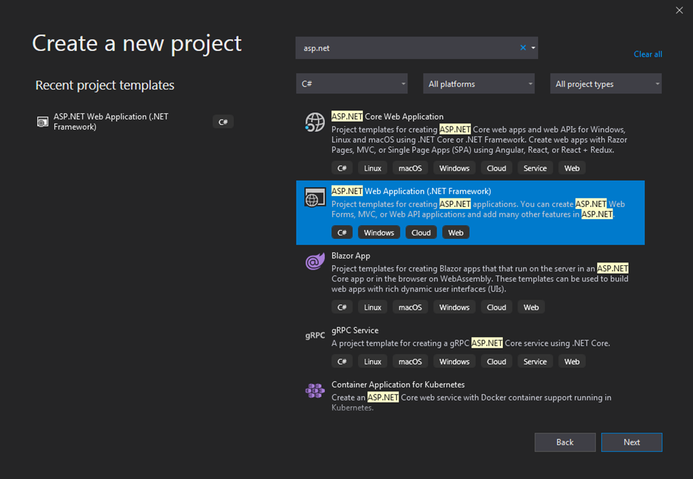
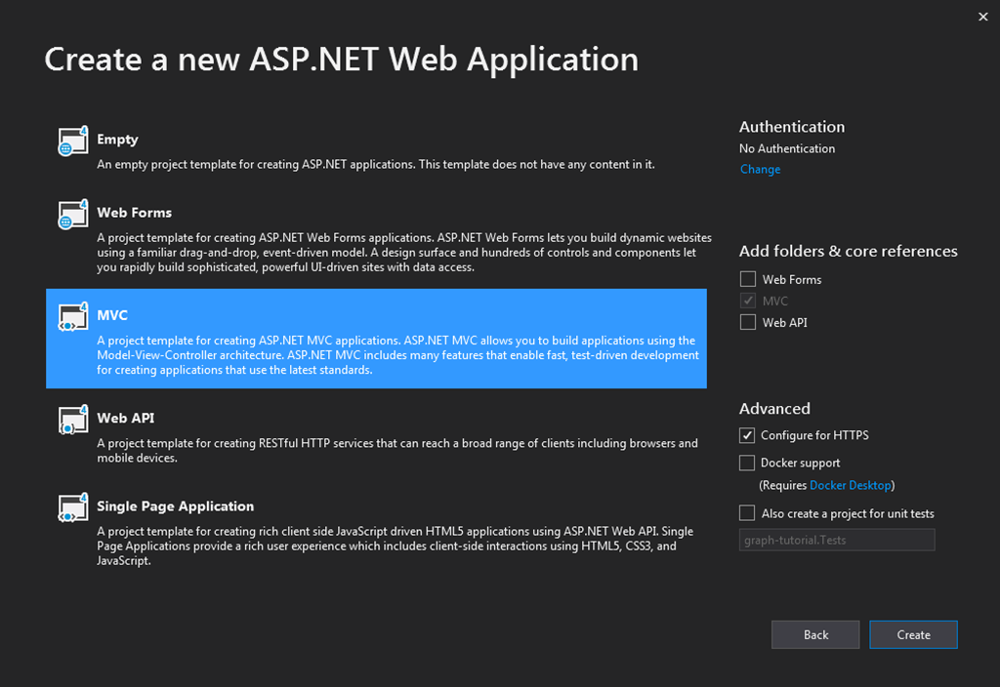

<!-- markdownlint-disable MD002 MD041 -->

Empiece por crear un proyecto de MVC de ASP.NET.

1. Abra Visual Studio y seleccione **crear un nuevo proyecto**.

1. En el cuadro de diálogo **crear nuevo proyecto** , elija la opción **aplicación Web de ASP.net (.NET Framework)** que usa C# y, a continuación, seleccione **siguiente**.

    

1. Escriba `graph-tutorial` en el campo **nombre del proyecto** y seleccione **crear**.

    

    > [!NOTE]
    > Asegúrese de que escribe exactamente el mismo nombre para el proyecto de Visual Studio que se especifica en estas instrucciones de la práctica. El nombre del proyecto de Visual Studio se convierte en parte del espacio de nombres en el código. El código incluido en estas instrucciones depende del espacio de nombres que coincida con el nombre de proyecto de Visual Studio especificado en estas instrucciones. Si usa un nombre de proyecto diferente, el código no se compilará a menos que ajuste todos los espacios de nombres para que se correspondan con el nombre del proyecto de Visual Studio que ha especificado al crear el proyecto.

1. Elija **MVC** y seleccione **crear**.

    

1. Presione **F5** o seleccione **depurar > iniciar depuración**. Si todo funciona, el explorador predeterminado debe abrir y mostrar una página ASP.NET predeterminada.

## <a name="add-nuget-packages"></a>Agregar paquetes NuGet

Antes de continuar, actualice el `bootstrap` paquete Nuget e instale algunos paquetes Nuget adicionales que usará más adelante.

- [Microsoft. Owin. host. SystemWeb](https://www.nuget.org/packages/Microsoft.Owin.Host.SystemWeb/) para habilitar las interfaces [Owin](http://owin.org/) en la aplicación ASP.net.
- [Microsoft. Owin. Security. OpenIdConnect](https://www.nuget.org/packages/Microsoft.Owin.Security.OpenIdConnect/) para realizar la autenticación de OpenID Connect con Azure.
- [Microsoft. Owin. Security. cookies](https://www.nuget.org/packages/Microsoft.Owin.Security.Cookies/) para habilitar la autenticación basada en cookies.
- [Microsoft. Identity. Client](https://www.nuget.org/packages/Microsoft.Identity.Client/) para solicitar y administrar tokens de acceso.
- [Microsoft. Graph](https://www.nuget.org/packages/Microsoft.Graph/) para realizar llamadas a Microsoft Graph.

1. Seleccione **herramientas > el administrador de paquetes de NuGet > consola del administrador de paquetes**.
1. En la consola del administrador de paquetes, escriba los siguientes comandos.

    ```Powershell
    Update-Package bootstrap
    Install-Package Microsoft.Owin.Host.SystemWeb
    Install-Package Microsoft.Owin.Security.OpenIdConnect
    Install-Package Microsoft.Owin.Security.Cookies
    Install-Package Microsoft.Identity.Client -Version 4.7.1
    Install-Package Microsoft.Graph -Version 1.20.0
    ```

## <a name="design-the-app"></a>Diseñar la aplicación

En esta sección, creará la estructura básica de la aplicación.

1. Crear una clase básica de inicio OWIN. Haga clic con el `graph-tutorial` botón secundario en la carpeta en el explorador de soluciones y seleccione **Agregar > nuevo elemento**. Elija la plantilla de **clase de inicio de OWIN** , `Startup.cs`asigne un nombre al archivo y seleccione **Agregar**.

1. Haga clic con el botón secundario en la carpeta **modelos** en el explorador de soluciones y seleccione **Agregar > clase...**. Asigne un nombre `Alert` a la clase y seleccione **Agregar**. Reemplace todo el contenido de `Alert.cs` con el código siguiente.

    ```cs
    namespace graph_tutorial.Models
    {
        // Used to flash error messages in the app's views.
        public class Alert
        {
            public const string AlertKey = "TempDataAlerts";
            public string Message { get; set; }
            public string Debug { get; set; }
        }
    }
    ```

1. Abra el `./Views/Shared/_Layout.cshtml` archivo y reemplace todo el contenido por el código siguiente para actualizar el diseño global de la aplicación.

    ```html
    @{
        var alerts = TempData.ContainsKey(graph_tutorial.Models.Alert.AlertKey) ?
            (List<graph_tutorial.Models.Alert>)TempData[graph_tutorial.Models.Alert.AlertKey] :
            new List<graph_tutorial.Models.Alert>();
    }

    <!DOCTYPE html>
    <html>
    <head>
        <meta charset="utf-8" />
        <meta name="viewport" content="width=device-width, initial-scale=1.0">
        <title>ASP.NET Graph Tutorial</title>
        @Styles.Render("~/Content/css")
        @Scripts.Render("~/bundles/modernizr")

        <link rel="stylesheet" href="https://use.fontawesome.com/releases/v5.1.0/css/all.css"
              integrity="sha384-lKuwvrZot6UHsBSfcMvOkWwlCMgc0TaWr+30HWe3a4ltaBwTZhyTEggF5tJv8tbt"
              crossorigin="anonymous">
    </head>

    <body>
        <nav class="navbar navbar-expand-md navbar-dark fixed-top bg-dark">
            <div class="container">
                @Html.ActionLink("ASP.NET Graph Tutorial", "Index", "Home", new { area = "" }, new { @class = "navbar-brand" })
                <button class="navbar-toggler" type="button" data-toggle="collapse" data-target="#navbarCollapse"
                        aria-controls="navbarCollapse" aria-expanded="false" aria-label="Toggle navigation">
                    <span class="navbar-toggler-icon"></span>
                </button>
                <div class="collapse navbar-collapse" id="navbarCollapse">
                    <ul class="navbar-nav mr-auto">
                        <li class="nav-item">
                            @Html.ActionLink("Home", "Index", "Home", new { area = "" },
                                new { @class = ViewBag.Current == "Home" ? "nav-link active" : "nav-link" })
                        </li>
                        @if (Request.IsAuthenticated)
                        {
                            <li class="nav-item" data-turbolinks="false">
                                @Html.ActionLink("Calendar", "Index", "Calendar", new { area = "" },
                                    new { @class = ViewBag.Current == "Calendar" ? "nav-link active" : "nav-link" })
                            </li>
                        }
                    </ul>
                    <ul class="navbar-nav justify-content-end">
                        <li class="nav-item">
                            <a class="nav-link" href="https://developer.microsoft.com/graph/docs/concepts/overview" target="_blank">
                                <i class="fas fa-external-link-alt mr-1"></i>Docs
                            </a>
                        </li>
                        @if (Request.IsAuthenticated)
                        {
                            <li class="nav-item dropdown">
                                <a class="nav-link dropdown-toggle" data-toggle="dropdown" href="#" role="button" aria-haspopup="true" aria-expanded="false">
                                    @if (!string.IsNullOrEmpty(ViewBag.User.Avatar))
                                    {
                                        
                                    }
                                    else
                                    {
                                        <i class="far fa-user-circle fa-lg rounded-circle align-self-center mr-2" style="width: 32px;"></i>
                                    }
                                </a>
                                <div class="dropdown-menu dropdown-menu-right">
                                    <h5 class="dropdown-item-text mb-0">@ViewBag.User.DisplayName</h5>
                                    <p class="dropdown-item-text text-muted mb-0">@ViewBag.User.Email</p>
                                    <div class="dropdown-divider"></div>
                                    @Html.ActionLink("Sign Out", "SignOut", "Account", new { area = "" }, new { @class = "dropdown-item" })
                                </div>
                            </li>
                        }
                        else
                        {
                            <li class="nav-item">
                                @Html.ActionLink("Sign In", "SignIn", "Account", new { area = "" }, new { @class = "nav-link" })
                            </li>
                        }
                    </ul>
                </div>
            </div>
        </nav>
        <main role="main" class="container">
            @foreach (var alert in alerts)
            {
                <div class="alert alert-danger" role="alert">
                    <p class="mb-3">@alert.Message</p>
                    @if (!string.IsNullOrEmpty(alert.Debug))
                    {
                        <pre class="alert-pre border bg-light p-2"><code>@alert.Debug</code></pre>
                    }
                </div>
            }

            @RenderBody()
        </main>
        @Scripts.Render("~/bundles/jquery")
        @Scripts.Render("~/bundles/bootstrap")
        @RenderSection("scripts", required: false)
    </body>
    </html>
    ```

    > [!NOTE]
    > Este código agrega un [bootstrap](https://getbootstrap.com/) para los estilos sencillos y la [fuente maravilla](https://fontawesome.com/) para algunos iconos simples. También define un diseño global con una barra de navegación y usa la `Alert` clase para mostrar las alertas.

1. Abra `Content/Site.css` y reemplace todo su contenido por el código siguiente.

    ```css
    body {
      padding-top: 4.5rem;
    }

    .alert-pre {
      word-wrap: break-word;
      word-break: break-all;
      white-space: pre-wrap;
    }
    ```

1. Abra el `Views/Home/index.cshtml` archivo y reemplace el contenido por lo siguiente.

    ```html
    @{
        ViewBag.Current = "Home";
    }

    <div class="jumbotron">
        <h1>ASP.NET Graph Tutorial</h1>
        <p class="lead">This sample app shows how to use the Microsoft Graph API to access Outlook and OneDrive data from ASP.NET</p>
        @if (Request.IsAuthenticated)
        {
            <h4>Welcome @ViewBag.User.DisplayName!</h4>
            <p>Use the navigation bar at the top of the page to get started.</p>
        }
        else
        {
            @Html.ActionLink("Click here to sign in", "SignIn", "Account", new { area = "" }, new { @class = "btn btn-primary btn-large" })
        }
    </div>
    ```

1. Haga clic con el botón secundario en la carpeta **Controladores** en el explorador de soluciones y seleccione **Agregar > controlador..**.. Elija **controlador de MVC 5: vacío** y seleccione **Agregar**. Asigne un nombre `BaseController` al controlador y seleccione **Agregar**. Reemplace el contenido de `BaseController.cs` por el siguiente código.

    ```cs
    using graph_tutorial.Models;
    using System.Collections.Generic;
    using System.Web.Mvc;

    namespace graph_tutorial.Controllers
    {
        public abstract class BaseController : Controller
        {
            protected void Flash(string message, string debug=null)
            {
                var alerts = TempData.ContainsKey(Alert.AlertKey) ?
                    (List<Alert>)TempData[Alert.AlertKey] :
                    new List<Alert>();

                alerts.Add(new Alert
                {
                    Message = message,
                    Debug = debug
                });

                TempData[Alert.AlertKey] = alerts;
            }
        }
    }
    ```

1. Abra `Controllers/HomeController.cs` y cambie la `public class HomeController : Controller` línea a:

    ```cs
    public class HomeController : BaseController
    ```

1. Guarde todos los cambios y reinicie el servidor. Ahora, la aplicación debe tener un aspecto muy diferente.

    
