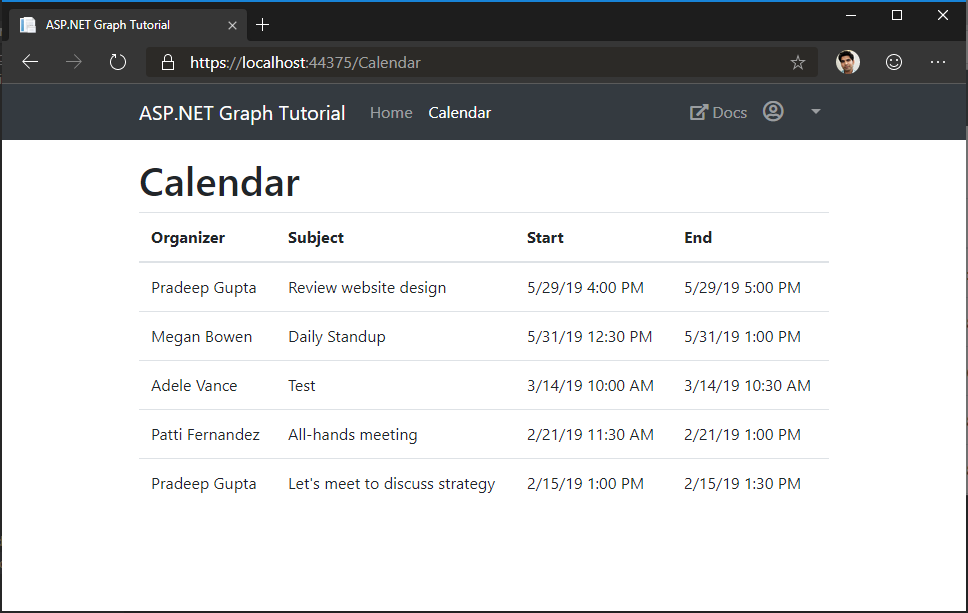

<!-- markdownlint-disable MD002 MD041 -->

En esta demostración, incorporará Microsoft Graph a la aplicación. Para esta aplicación, usará la [biblioteca de cliente de Microsoft Graph para .net](https://github.com/microsoftgraph/msgraph-sdk-dotnet) para realizar llamadas a Microsoft Graph.

## <a name="get-calendar-events-from-outlook"></a>Obtener eventos de calendario de Outlook

Empiece extendiendo la `GraphHelper` clase que creó en el último módulo.

1. Agregue las siguientes `using` instrucciones en la parte superior del `Helpers/GraphHelper.cs` archivo.

    ```cs
    using graph_tutorial.TokenStorage;
    using Microsoft.Identity.Client;
    using System.Collections.Generic;
    using System.Configuration;
    using System.Linq;
    using System.Security.Claims;
    using System.Web;
    ```

1. Agregue el siguiente código a la `GraphHelper` clase.

    ```cs
    // Load configuration settings from PrivateSettings.config
    private static string appId = ConfigurationManager.AppSettings["ida:AppId"];
    private static string appSecret = ConfigurationManager.AppSettings["ida:AppSecret"];
    private static string redirectUri = ConfigurationManager.AppSettings["ida:RedirectUri"];
    private static string graphScopes = ConfigurationManager.AppSettings["ida:AppScopes"];

    public static async Task<IEnumerable<Event>> GetEventsAsync()
    {
        var graphClient = GetAuthenticatedClient();

        var events = await graphClient.Me.Events.Request()
            .Select("subject,organizer,start,end")
            .OrderBy("createdDateTime DESC")
            .GetAsync();

        return events.CurrentPage;
    }

    private static GraphServiceClient GetAuthenticatedClient()
    {
        return new GraphServiceClient(
            new DelegateAuthenticationProvider(
                async (requestMessage) =>
                {
                    var idClient = ConfidentialClientApplicationBuilder.Create(appId)
                        .WithRedirectUri(redirectUri)
                        .WithClientSecret(appSecret)
                        .Build();

                    var tokenStore = new SessionTokenStore(idClient.UserTokenCache,
                            HttpContext.Current, ClaimsPrincipal.Current);

                    var accounts = await idClient.GetAccountsAsync();

                    // By calling this here, the token can be refreshed
                    // if it's expired right before the Graph call is made
                    var scopes = graphScopes.Split(' ');
                    var result = await idClient.AcquireTokenSilent(scopes, accounts.FirstOrDefault())
                        .ExecuteAsync();

                    requestMessage.Headers.Authorization =
                        new AuthenticationHeaderValue("Bearer", result.AccessToken);
                }));
    }
    ```

    > [!NOTE]
    > Tenga en cuenta lo que está haciendo este código.
    >
    > - La `GetAuthenticatedClient` función Inicializa un `GraphServiceClient` con un proveedor de autenticación que llama `AcquireTokenSilent`a.
    > - En la `GetEventsAsync` función:
    >   - La dirección URL a la que se `/v1.0/me/events`llamará es.
    >   - La `Select` función limita los campos devueltos para cada evento a solo aquellos que la vista usará realmente.
    >   - La `OrderBy` función ordena los resultados por la fecha y hora en que se crearon, con el elemento más reciente en primer lugar.

1. Cree un controlador para las vistas de calendario. Haga clic con el botón secundario en la carpeta **Controladores** en el explorador de soluciones y seleccione **Agregar > controlador..**.. Elija **controlador de MVC 5: vacío** y seleccione **Agregar**. Asigne un nombre `CalendarController` al controlador y seleccione **Agregar**. Reemplace todo el contenido del nuevo archivo por el siguiente código.

    ```cs
    using graph_tutorial.Helpers;
    using System;
    using System.Threading.Tasks;
    using System.Web.Mvc;

    namespace graph_tutorial.Controllers
    {
        public class CalendarController : BaseController
        {
            // GET: Calendar
            [Authorize]
            public async Task<ActionResult> Index()
            {
                var events = await GraphHelper.GetEventsAsync();

                // Change start and end dates from UTC to local time
                foreach (var ev in events)
                {
                    ev.Start.DateTime = DateTime.Parse(ev.Start.DateTime).ToLocalTime().ToString();
                    ev.Start.TimeZone = TimeZoneInfo.Local.Id;
                    ev.End.DateTime = DateTime.Parse(ev.End.DateTime).ToLocalTime().ToString();
                    ev.End.TimeZone = TimeZoneInfo.Local.Id;
                }

                return Json(events, JsonRequestBehavior.AllowGet);
            }
        }
    }
    ```

1. Inicie la aplicación, inicie sesión y haga clic en el vínculo de **calendario** en la barra de navegación. Si todo funciona, debería ver un volcado JSON de eventos en el calendario del usuario.

## <a name="display-the-results"></a>Mostrar los resultados

Ahora puede Agregar una vista para mostrar los resultados de forma más fácil de uso.

1. En el explorador de soluciones, haga clic con el botón secundario en la carpeta **vistas/calendario** y seleccione **Agregar > vista...**. Asigne un nombre `Index` a la vista y seleccione **Agregar**. Reemplace todo el contenido del nuevo archivo por el siguiente código.

    ```html
    @model IEnumerable<Microsoft.Graph.Event>

    @{
        ViewBag.Current = "Calendar";
    }

    <h1>Calendar</h1>
    <table class="table">
        <thead>
            <tr>
                <th scope="col">Organizer</th>
                <th scope="col">Subject</th>
                <th scope="col">Start</th>
                <th scope="col">End</th>
            </tr>
        </thead>
        <tbody>
            @foreach (var item in Model)
            {
                <tr>
                    <td>@item.Organizer.EmailAddress.Name</td>
                    <td>@item.Subject</td>
                    <td>@Convert.ToDateTime(item.Start.DateTime).ToString("M/d/yy h:mm tt")</td>
                    <td>@Convert.ToDateTime(item.End.DateTime).ToString("M/d/yy h:mm tt")</td>
                </tr>
            }
        </tbody>
    </table>
    ```

    Se recorrerá en bucle una colección de eventos y se agregará una fila de tabla para cada uno.

1. Quite la `return Json(events, JsonRequestBehavior.AllowGet);` línea de la `Index` función en `Controllers/CalendarController.cs`y reemplácela por el código siguiente.

    ```cs
    return View(events);
    ```

1. Inicie la aplicación, inicie sesión y haga clic en el vínculo **calendario** . La aplicación ahora debería representar una tabla de eventos.

    
